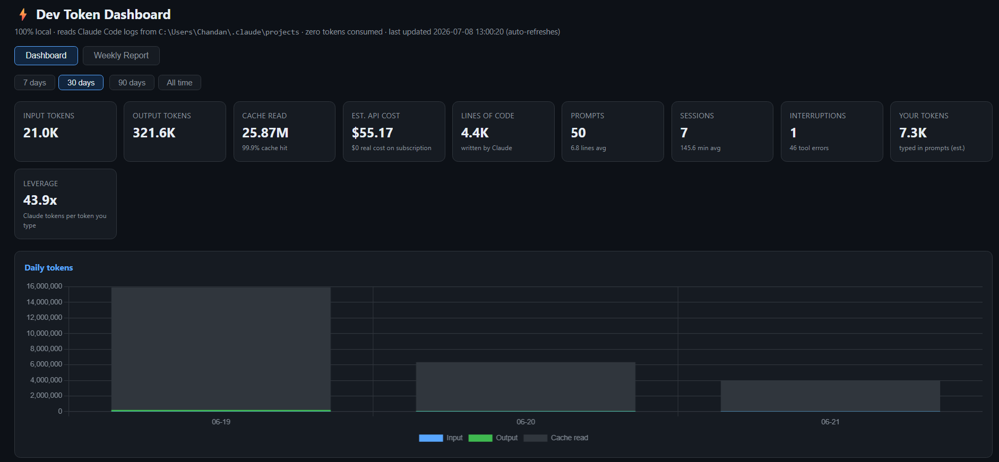
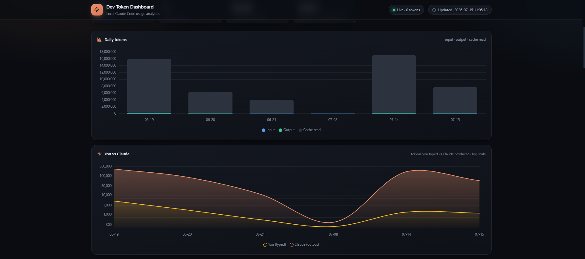
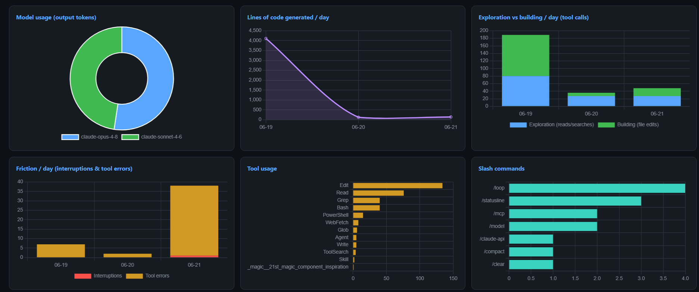
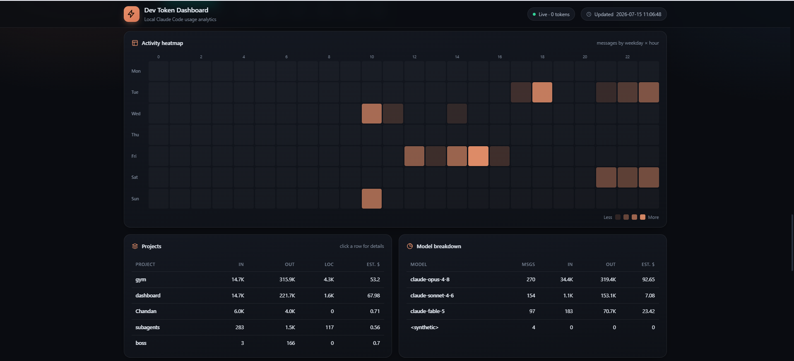
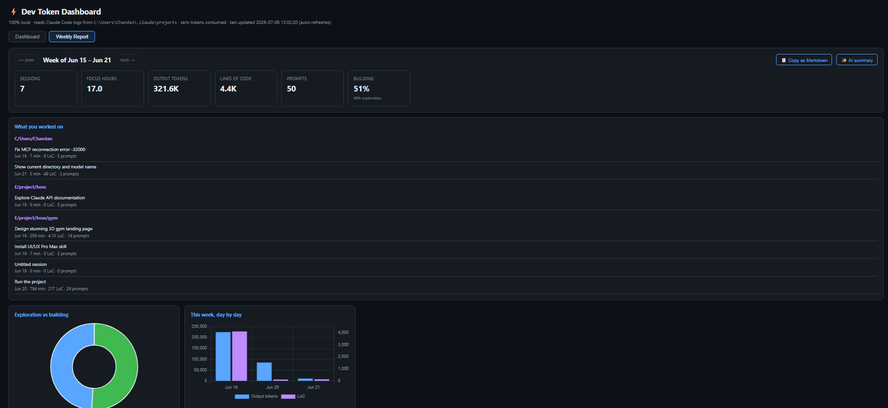

# ⚡ Dev Token Dashboard

A **100% local** dashboard for your Claude Code usage. Zero token cost — it
never calls any API. It reads the session logs Claude Code already saves on
your machine and turns them into live charts, developer insights, and a
ready-to-paste **weekly update**.

One Python file, standard library only, no pip installs, works offline.



**How is this different from [ccusage](https://github.com/ryoppippi/ccusage)?**
ccusage is a great token/cost counter. This focuses on *developer insights* —
leverage ratio, exploration-vs-building, friction, per-project deep-dives —
plus a **Weekly Report tab that writes your standup update for you**. And it
needs no Node/npm: just Python, which you already have.

## Quick start

```
git clone https://github.com/chandan12ar/dev-token-dashboard.git
cd dev-token-dashboard
python dev_token_dashboard.py
```

Opens http://localhost:8787. Requires Python 3.8+ and a machine where
Claude Code has been used (it reads `~/.claude/projects/`).

Full instructions, auto-start at logon, and troubleshooting: **[SETUP.md](SETUP.md)**

## What you get

### Dashboard tab
- **KPI cards** — input/output tokens, cache read + hit %, estimated API
  cost, lines of code Claude wrote, prompts, sessions, interruptions +
  tool errors, your typed tokens, and your **leverage ratio** (Claude
  output tokens per token you type)
- **Charts** — daily tokens, "You vs Claude" balance (log scale), model
  doughnut + breakdown, LoC per day, **exploration vs building** per day,
  **friction** per day, tool & slash-command usage, weekday×hour heatmap
- **Tables** — projects (click a row for a per-project deep-dive with its
  own timeline, sessions, and files), model breakdown, git branches,
  longest prompts, most-edited files
- **Time ranges** — 7 / 30 / 90 days / all time

### Weekly Report tab
Built for standups. For any week it shows **what you worked on** (session
titles grouped by project — Claude Code already stores an AI title for
every session, so this is free), KPIs with week-over-week deltas, and an
exploration-vs-building gauge. Then:

- **📋 Copy as Markdown** — one click gives you a formatted weekly update
  to paste into Teams, Slack, or email
- **✨ AI summary** (optional) — pipes the week through `claude -p` for a
  polished first-person paragraph. The only feature that costs tokens, and
  only when you press it.

## Screenshots

| | |
|---|---|
|  |  |
|  |  |

## Privacy

Everything stays on your machine. The server binds to `127.0.0.1` only,
Chart.js is bundled locally, and the page makes zero external requests.
Your prompts and logs never leave your disk.

## Notes

- Cost is an *estimate* at public API pricing — on a subscription plan your
  real marginal cost is $0. Tune the `PRICING` table at the top of the script.
- Token totals are **deduplicated per API response**, which is why they're
  lower (and more accurate) than the official Claude Code panel's count —
  the full analysis is in [docs/TOKEN_COUNTS.md](docs/TOKEN_COUNTS.md).
- LoC counts lines written via Write/Edit/MultiEdit/NotebookEdit tool
  calls — additions, not a git diff.

## Docs

- [SETUP.md](SETUP.md) — install, run, auto-start on Windows/macOS/Linux
- [docs/HOW_IT_WORKS.md](docs/HOW_IT_WORKS.md) — architecture and every panel explained
- [docs/TOKEN_COUNTS.md](docs/TOKEN_COUNTS.md) — why our token counting is the correct one

## License

MIT — see [LICENSE](LICENSE).
