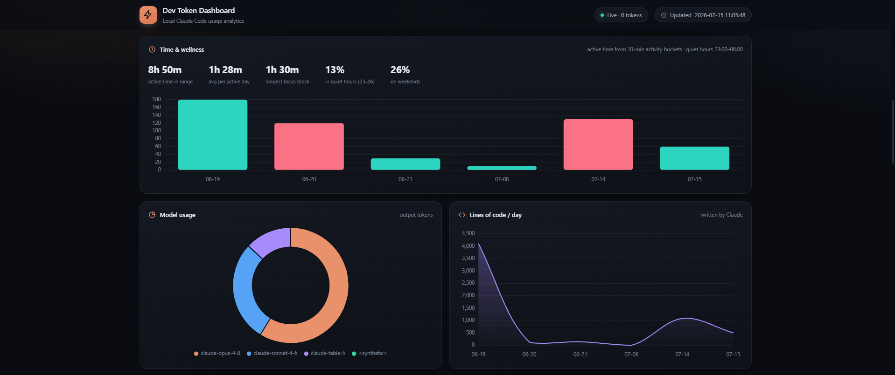
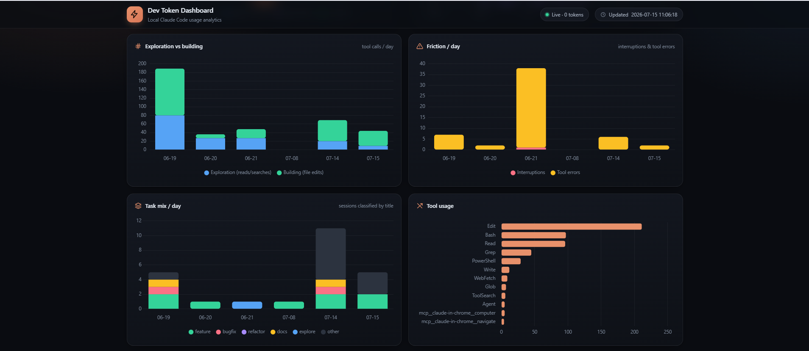
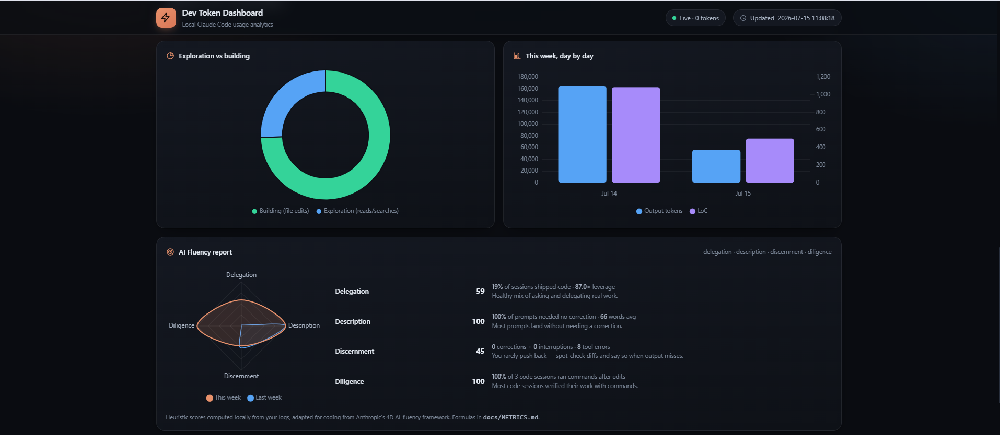

# ⚡ Dev Token Dashboard

A **100% local** dashboard for your Claude Code usage. Zero token cost — it
never calls any API. It reads the session logs Claude Code already saves on
your machine and turns them into live charts, developer insights, and a
ready-to-paste **weekly update**.

One Python file, standard library only, no pip installs, works offline.


**How is this different from [ccusage](https://github.com/ryoppippi/ccusage)?**
ccusage is a great token/cost counter. This focuses on *developer insights* —
leverage ratio, exploration-vs-building, friction, per-project deep-dives —
plus a **Weekly Report tab that writes your standup update for you**. And it
needs no Node/npm: just Python, which you already have.

## Quick start

```
git clone https://github.com/chandan12ar/dev-token-dashboard.git
cd dev-token-dashboard
python dev_token_dashboard.py
```

Opens http://localhost:8787. Requires Python 3.8+ and a machine where
Claude Code has been used (it reads `~/.claude/projects/`).

Full instructions, auto-start at logon, and troubleshooting: **[SETUP.md](SETUP.md)**

## What's new (v1.2) — the "Reflect" update

Inspired by Anthropic's [Reflect with Claude](https://www.anthropic.com/news/reflect-with-claude)
(which covers claude.ai chat but *not* Claude Code — that's what this fills):

- **AI Fluency report** — weekly 0–100 scores on the four AI-fluency
  dimensions (Delegation, Description, Discernment, Diligence), adapted for
  coding, with a radar chart vs last week and a concrete tip per dimension
- **Time & wellness panel** — active time from 10-minute activity buckets,
  average per active day, longest focus block, quiet-hours (23:00–06:00) and
  weekend shares, plus an active-minutes chart that flags late-night-heavy days
- **Reflection question** — each week the data picks one question worth
  sitting with (too many corrections? all exploration? never verifying?), with
  a **Discuss with Claude** button that runs `claude -p` locally on demand
- **Task mix** — sessions auto-classified into feature / bugfix / refactor /
  docs / explore from their AI titles, stacked per day, and included in the
  weekly markdown export
- **Fix** — `Restart-Dashboard.ps1` now also kills Store-Python processes
  (`pythonw3.11.exe`), which previously survived restarts holding stale code

All of it 100% local and zero-token, except the two explicit `claude -p` buttons.

## What's new (v1.1)

- **Complete UI redesign** — sticky glass header, icon KPI cards with accent
  colors, gradient charts, dark theme polish, responsive layout, and a live
  "0 tokens" status pill
- **Custom date ranges** — a from–to date picker next to the 7/30/90/all
  buttons; the whole page (every chart, table, and the project modal)
  now respects the selected range, not just the headline KPIs
- **Period-over-period deltas** — KPI cards show ▲/▼ % vs the previous
  equal-length window
- **Momentum bar** — current & best day **streak**, all-time active days,
  and optional **personal goals** with progress bars (daily LoC, daily /
  weekly token budgets — set them in the `GOALS` dict)
- **Exports** — copy a text summary, download the daily table as **CSV**,
  or the full stats payload as **JSON**
- **Sturdier AI summary** — resolves the `claude` executable directly,
  5-minute timeout, and real error messages when it fails
- **Restart scripts** — `Restart-Dashboard.bat` kills every running copy
  and relaunches a fresh windowless instance (handy after editing the script)
- **Accuracy fixes** — session count/average now follow the selected range,
  timestamps are bucketed in your local timezone, and avg prompt words is
  range-scoped

Full formula reference for every metric: **[docs/METRICS.md](docs/METRICS.md)**

## What you get

### Dashboard tab
- **KPI cards** — input/output tokens, cache read + hit %, estimated API
  cost, lines of code Claude wrote, prompts, sessions, friction (interruptions
  + tool errors), your typed tokens, and your **leverage ratio** (Claude
  output tokens per token you type) — each with a Δ vs the previous period
- **Momentum bar** — day streak, best streak, active days, and goal
  progress bars
- **Charts** — daily tokens, "You vs Claude" balance (log scale), model
  doughnut + breakdown, LoC per day, **exploration vs building** per day,
  **friction** per day, **task mix** per day, tool & slash-command usage,
  weekday×hour heatmap
- **Time & wellness** — active time, longest focus block, quiet-hours and
  weekend shares, active-minutes chart
- **Tables** — projects (click a row for a per-project deep-dive with its
  own timeline, sessions, and files), model breakdown, git branches,
  longest prompts, most-edited files
- **Time ranges** — 7 / 30 / 90 days / all time / custom from–to dates;
  everything on the page follows the selection
- **Exports** — copy summary, CSV of daily stats, full JSON payload

### Weekly Report tab
Built for standups. For any week it shows **what you worked on** (session
titles grouped by project — Claude Code already stores an AI title for
every session, so this is free), KPIs with week-over-week deltas, and an
exploration-vs-building gauge. Then:

- **🎯 AI Fluency report** — radar chart + per-dimension scores and tips
  (Delegation · Description · Discernment · Diligence)
- **💡 Reflection** — one data-backed question about how you worked this
  week, with an optional **Discuss with Claude** button
- **📋 Copy as Markdown** — one click gives you a formatted weekly update
  (now including the task mix) to paste into Teams, Slack, or email
- **✨ AI summary** (optional) — pipes the week through `claude -p` for a
  polished first-person paragraph. Along with "Discuss with Claude", the
  only features that cost tokens, and only when you press them.

## Screenshots

| | |
|---|---|
| **Daily tokens & You vs Claude**<br> | **Time & wellness**<br> |
| **Exploration, friction & task mix**<br> | **AI Fluency report**<br> |
| **Heatmap & tables**<br> | **Weekly Report**<br> |

## Privacy

Everything stays on your machine. The server binds to `127.0.0.1` only,
Chart.js is bundled locally, and the page makes zero external requests.
Your prompts and logs never leave your disk.

## Notes

- Cost is an *estimate* at public API pricing — on a subscription plan your
  real marginal cost is $0. Tune the `PRICING` table at the top of the script.
- Token totals are **deduplicated per API response**, which is why they're
  lower (and more accurate) than the official Claude Code panel's count —
  the full analysis is in [docs/TOKEN_COUNTS.md](docs/TOKEN_COUNTS.md).
- LoC counts lines written via Write/Edit/MultiEdit/NotebookEdit tool
  calls — additions, not a git diff.

## Docs

- [SETUP.md](SETUP.md) — install, run, auto-start on Windows/macOS/Linux
- [docs/HOW_IT_WORKS.md](docs/HOW_IT_WORKS.md) — architecture and every panel explained
- [docs/METRICS.md](docs/METRICS.md) — **the math**: exact formula behind every metric, what each dashboard section means, and the known approximations
- [docs/TOKEN_COUNTS.md](docs/TOKEN_COUNTS.md) — why our token counting is the correct one

## License

MIT — see [LICENSE](LICENSE).
